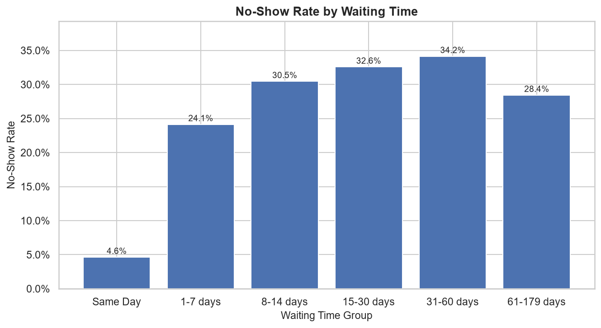
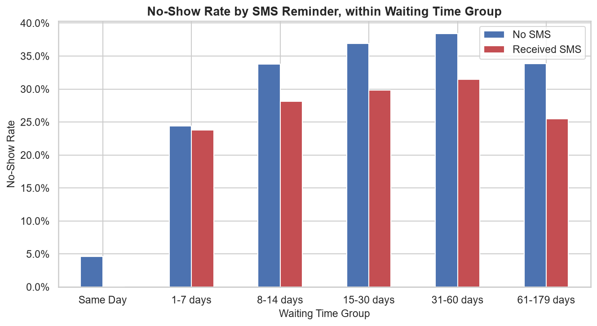
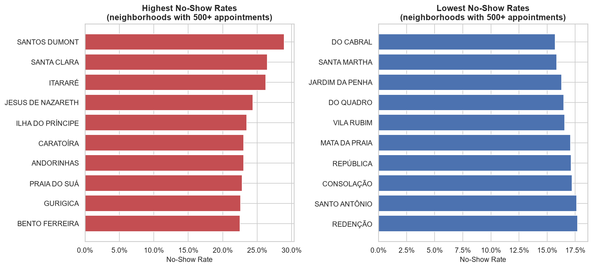
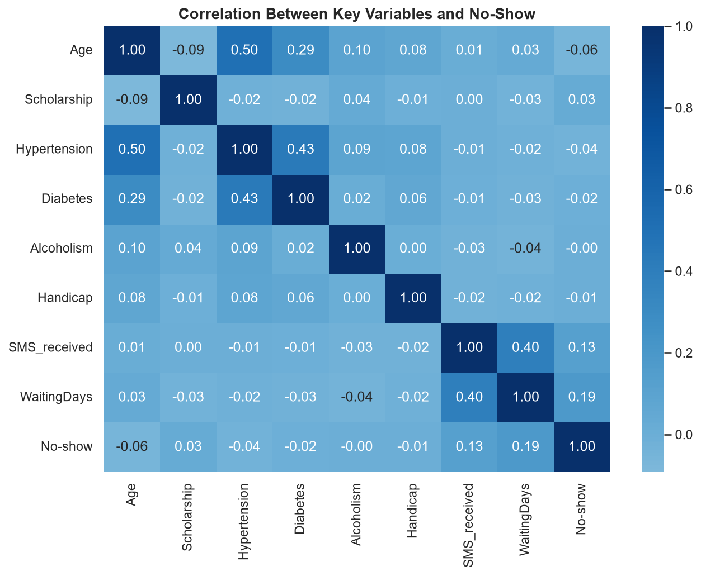

# Medical Appointment No-Show Exploratory Data Analysis

Missed appointments are expensive for clinics and disruptive for patients waiting behind them. This project digs into a dataset of over 110,000 medical appointments from Brazil to ask a simple question: which patient and appointment characteristics actually line up with a no-show?

Rather than jumping straight to a predictive model, this is a ground-up exploration. It inspects the data, checks its quality, and lets the patterns in demographics, health conditions, and appointment logistics tell their own story before drawing any conclusions.

## Tools

- Python
- Pandas
- NumPy
- Matplotlib
- Seaborn
- Jupyter Notebook

## What's in the Analysis

- Dataset inspection and data quality checks
- Missing value, duplicate, and invalid value analysis
- Attendance rate overview (Positive/Negative style class balance)
- Demographic breakdowns (gender, age, age groups)
- Health and socioeconomic factors (hypertension, diabetes, alcoholism, handicap, scholarship)
- Appointment characteristics (waiting time, SMS reminders, day of week)
- Neighborhood level attendance patterns
- Visualizations throughout, built with Matplotlib and Seaborn

## Key Findings

- The dataset covers 110,527 appointments, with roughly 80% attended and 20% resulting in a no-show.
- Waiting time, the gap between scheduling and the appointment itself, showed the strongest association with attendance. Same-day appointments had a no-show rate of just 4.6%, climbing to over 30% once the wait passed a month.



- Age had a real but moderate relationship with attendance. Patients aged 18 to 29 missed appointments noticeably more often than patients 45 and older.
- SMS reminders looked counterintuitive at first, since recipients had a higher raw no-show rate. That reversed once waiting time was accounted for, since SMS is never sent for same-day bookings. Within similar waiting-time bands, SMS recipients actually showed lower no-show rates.



- Neighborhood mattered more than expected, with reliable no-show rates ranging from roughly 16% to 29% across the city, and those gaps persisting even within similar waiting-time groups.



- Scholarship status showed a modest, consistent association that held up across age groups.
- Gender, day of week, and most individual health conditions (hypertension, diabetes, alcoholism) showed weak associations, showing that a variable being present in the data doesn't guarantee it's predictive.



## Limitations

Please note that this is an associations-based analysis, not a causal one. Several variables are intertwined, SMS receipt and waiting time in particular, so raw comparisons can be misleading until confounders are checked. Some subgroups (certain neighborhoods, higher handicap levels) have very small sample sizes and shouldn't be over-interpreted. And since this project stops at exploration, it doesn't test how well any of these features would actually hold up predicting outcomes for new patients.

A natural next step would be to take these findings and build out a classification model to see how well they generalize.

## Potential Implications

- The strong relationship between waiting time and no-shows suggests that appointment reminder strategies could be worth investigating for bookings made far in advance. This analysis does not establish that additional reminders would causally reduce no-shows.
- The elevated no-show rate among patients aged 18 to 29 suggests this group may be worth prioritizing in future outreach research, though the underlying cause of the age difference isn't addressed here.
- Neighborhood differences that persist across waiting-time groups point to factors outside this dataset, such as transportation access or clinic proximity, as areas worth investigating further.
- The scholarship gap raises a question worth pursuing rather than a pattern to act on directly, since the dataset doesn't explain why it exists.

## Dataset

This project uses the Medical Appointment No Shows dataset from Kaggle.

- Dataset: Medical Appointment No Shows
- Source: Kaggle
- Records: 110,527 appointments across 14 features, tied to appointment scheduling, patient demographics, and health/socioeconomic conditions

Used here strictly for educational and exploratory purposes.

## Project Structure

```
medical_appointment_noshow-eda/
├── medical_noshow_eda.ipynb
├── medical_noshow_data.csv
├── images/
│   ├── waiting_time_noshow.png
│   ├── sms_reversal.png
│   ├── neighborhood_comparison.png
│   └── correlation_heatmap.png
├── LICENSE
└── README.md
```
